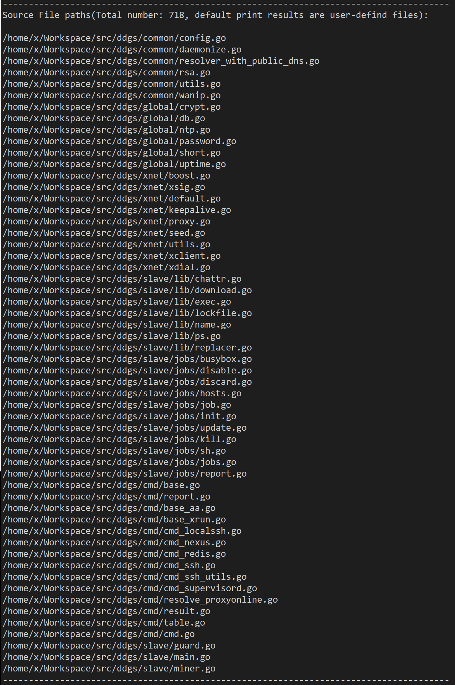

## Yet Another Golang binary parser for IDAPro

**English | [中文](./README_cn.md)**

---------------------------------------------------------------------

### Instructions for Python3 branch

This version is developed and tested on macos , ida7.4+ and python3.8.5,
If there are problems on other platforms and version, you are welcomed to submit issue or pull requst.

**In addition, it should be noted that ida7.4 on MacOS uses Python 3 installed by default, which may cause the third-party library installed by yourself to fail to load. You need to switch to Python installed by brew. Please refer to [this script](https://raw.githubusercontent.com/idapython/src/master/tools/patch-idapython-homebrew.sh) for specific switching methods.**

----------------------------------------------------------------------

Inspired by [golang_loader_assist](https://github.com/strazzere/golang_loader_assist) and [jeb-golang-analyzer](https://github.com/pnfsoftware/jeb-golang-analyzer), I wrote a more complete Go binaries parsing tool for IDAPro.

### Main Features：

1. Locate and parse **firstmoduledata** structure in Go binary file, and make comment for each field;
2. Locate **pclntab**(PC Line Table) according to the **firstmoduledata** and parse it. Then find and parse and recover function names and source file paths in the pclntab. Source file paths will be printed in the output window of IDAPro；
3. Parse strings and string pointers, make comment for each string, and make **dref** for each string pointer；
4. According to firstmoduledata, find each **type** and parse it, meke comment for each attribute of **type**, which will be very convenient for malware researcher to analyze a complex type or data structure definition；
5. Parse **itab**(Interface Table).

Helpful information to RE work for Go binaries:

And there are two useful feature in **go_parser**:

1. It also work fine for binaries with malformed File Header information, especially malformed Section Headers information;
2. All those features above are valid for binaries built with **buildmode=pie**.

A config data structure in DDGMiner v5029 (MD5: 95199e8f1ab987cd8179a60834644663) parsing result as below：

And the user-defined source file paths list:

### Project files：

- **go_parser.py** ：Entry file, press **[Alt+F7]** , select and execute this file；
- **common.py**: Common variables and functions definition；
- **pclntbl.py**: Parse **pclntab**(PC Line Table);
- **strings.py**: Parse strings 和 string pointers；
- **moduldata.py**: Parse **firstmoduledata**；
- **types_builder.py**: Parse **types** ；
- **itab.py**: Parse **itab**(Interface Table)；

Additionally, the **str_ptr.py** will parse string pointers by specify the start address and end address of string pointers manually.

### Note

1. This tool is written in Python2, and tested only on IDA7.2/IDA7.0;
2. The strings parsing module was migrated from [golang_loader_assist](https://github.com/strazzere/golang_loader_assist), and I added the feature of string pointers parsing. It only supports x86(32bit & 64bit) architecture for now.

### Refer

1. [Analyzing Golang Executables](https://www.pnfsoftware.com/blog/analyzing-golang-executables/)
2. [Reversing GO binaries like a pro](https://rednaga.io/2016/09/21/reversing_go_binaries_like_a_pro/)
3. [Reconstructing Program Semantics from Go binaries.pdf](http://home.in.tum.de/~engelke/pubs/1709-ma.pdf)
4. [Go二进制文件逆向分析从基础到进阶——综述](https://www.anquanke.com/post/id/214940)
5. [Go二进制文件逆向分析从基础到进阶——MetaInfo、函数符号和源码文件路径列表](https://www.anquanke.com/post/id/215419)
6. [Go二进制文件逆向分析从基础到进阶——数据类型](https://www.anquanke.com/post/id/215820)
7. [Go二进制文件逆向分析从基础到进阶——itab与strings](https://www.anquanke.com/post/id/218377)
8. [Go二进制文件逆向分析从基础到进阶——Tips与实战案例](https://www.anquanke.com/post/id/218674)