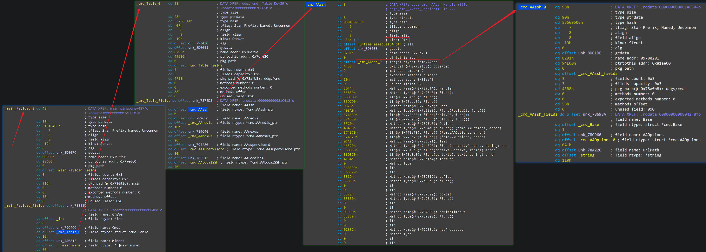

## Yet Another Golang binary parser for IDAPro

**[English](./README.md) | 中文**

----------------------------------------------------------------------

> :bulb: **注意**:
>
> **master** 分支由 Python2 版的 IDAPython 编写，仅在 IDAPro 7.2/7.0 版本测试过。如果您在用 Python3.x 版的 IDAPython 和更高版本的 IDAPro ，请使用 go_parser 的 **[Python3 分支](https://github.com/0xjiayu/go_parser/tree/py3)**。

受 [golang_loader_assist](https://github.com/strazzere/golang_loader_assist) 和 [jeb-golang-analyzer](https://github.com/pnfsoftware/jeb-golang-analyzer) 启发，为 IDAPro 写了一个更完备的 Go 二进制文件解析工具。

### 核心功能：

1. 自动定位 **firstmoduledata** 的位置并解析；
2. 根据 firstmoduledata 中的信息定位到 **pclntab**(PC Line Table)，并从 pclntab 入手解析、恢复**函数符号**，抽取**源码文件列表**；
3. 解析 **strings** 和 string **pointers**；
4. 根据 firstmoduledata 中的信息，解析所有 **types** 并为 types 各种属性打上有意义的 comment 或 dref；
5. 解析 **itab**(Interface Table)。

Go 语言二进制文件中对逆向分析有帮助的信息如下：

另外，**go_parser** 还有两个很有用的特性：

1. 以上功能对于 **buildmode=pie** 类型的 Go binary 文件依然有效；
2. 对于文件头信息尤其是 Section Header 信息损坏的二进制文件依然有效。

DDGMiner v5029 (MD5: 95199e8f1ab987cd8179a60834644663) 样本中核心的配置文件 struct 解析结果示例如下：

样本源码文件列表：

### 文件列表：

- **go_parser.py** ：整套工具的入口文件，在 IDAPro 中 **[Alt+F7]** 组合键，执行此脚本；
- **common.py**: 通用变量和函数定义；
- **pclntbl.py**: 解析 **pclntab**(PC Line Table);
- **strings.py**: 解析 strings 和 string pointers；
- **moduldata.py**: 解析 **firstmoduledata**；
- **types_builder.py**: 解析所有 **types** ；
- **itab.py**: 解析 **itab**(Interface Table)。

另外， **str_ptr.py** 可以通过手动指定**字符串指针**数据的起始、结束位置来解析**字符串指针**。

### Note

1. 此分支由 Python2 版的 IDAPython API 编写，只在 IDAPro v7.2/v7.0 上测试过，其他的 IDA 版本未经测试；
2. strings 解析模块从 [golang_loader_assist](https://github.com/strazzere/golang_loader_assist) 移植过来，我自己又增加了 string pointers 解析的功能，目前只支持 x86 架构。

### Refer

1. [Analyzing Golang Executables](https://www.pnfsoftware.com/blog/analyzing-golang-executables/)
2. [Reversing GO binaries like a pro](https://rednaga.io/2016/09/21/reversing_go_binaries_like_a_pro/)
3. [Reconstructing Program Semantics from Go binaries.pdf](http://home.in.tum.de/~engelke/pubs/1709-ma.pdf)
4. [Go二进制文件逆向分析从基础到进阶——综述](https://www.anquanke.com/post/id/214940)
5. [Go二进制文件逆向分析从基础到进阶——MetaInfo、函数符号和源码文件路径列表](https://www.anquanke.com/post/id/215419)
6. [Go二进制文件逆向分析从基础到进阶——数据类型](https://www.anquanke.com/post/id/215820)
7. [Go二进制文件逆向分析从基础到进阶——itab与strings](https://www.anquanke.com/post/id/218377)
8. [Go二进制文件逆向分析从基础到进阶——Tips与实战案例](https://www.anquanke.com/post/id/218674)